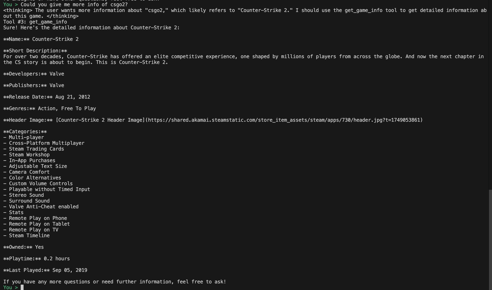
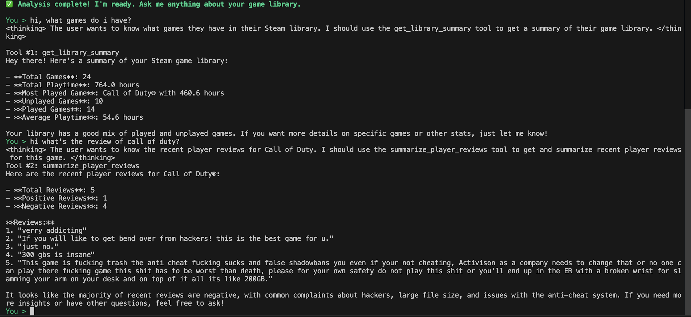

# Steam Stats Agent

A game library analysis and reporting agent built with AWS Strands SDK. This agent fetches a user's Steam game library, analyzes playtime statistics, and generates comprehensive reports with insights about gaming habits.


## Features

- 🎮 Fetch a user's complete Steam game library using the Steam Web API
- 📊 Analyze playtime statistics and gaming patterns across your entire collection
- 📈 Generate detailed reports with insights about gaming habits and preferences
- 🏆 Identify most played games, unplayed games, and neglected favorites
- 🕹️ Track recently played games and discover forgotten gems in your library
- 📱 Get detailed information about any game on Steam (owned or not)
- 💬 View and analyze recent player reviews and community sentiment
- 📁 Export game library data to CSV for further analysis in spreadsheet software
- 🌈 Beautiful, colorful terminal output with formatted tables and progress indicators

## Development Prompts

This project was developed iteratively using the following prompts:  [Notion Documentation](https://www.notion.so/strand-demo-game-data-234232d22c5d804b887bc6724a2555db?source=copy_link)

### Prompt A: Initial Project Setup

The first prompt focused on creating the basic project structure and functionality:
- Setting up the project directory and virtual environment
- Implementing Steam API integration
- Creating basic analysis tools
- Building a command-line interface with formatted output
- Setting up error handling and configuration

Key features from this phase:
- Project structure and dependency management
- Steam API integration for fetching game data
- Basic analysis and reporting functionality
- Formatted CLI output with tables and colors
- Setup script for easy installation

### Prompt B: Interactive Chat Implementation

The second prompt enhanced the project with interactive chat capabilities:
- Converting the one-time report into an interactive chat session
- Pre-loading game data for instant responses
- Creating granular analysis tools for specific queries
- Implementing natural language understanding for game queries

Key features added:
- Interactive chat loop
- Pre-loaded game data analysis
- Conversational interface
- Specific game lookup functionality

### Prompt C: Enhanced Game Information

The third prompt added rich game information and review analysis:
- Detailed game information fetching
- Player review analysis
- Support for non-owned games
- Enhanced error handling and rate limiting

Key features added:
- Detailed game information lookup
- Player review summaries
- Support for querying any Steam game
- Improved error handling and API interaction

## Example Conversation

Here's an example of how the interactive chat works:

```
🎮 STEAM STATS AGENT
══════════════════════
Enter your SteamID or vanity URL: [user_enters_id]
🔍 Analyzing your 256 games, please wait...
✅ Analysis complete! I'm ready. Ask me anything about your game library.

Agent > How can I help you?
You > how many games do i have
Agent > You have a total of 256 games in your library.

You > what are my top 3 most played games?
Agent > Your top 3 most played games are:
1. Counter-Strike 2 (1,205.5 hours)
2. Elden Ring (250.1 hours)
3. The Witcher 3: Wild Hunt (180.7 hours)

You > how many hours did i play the witcher
Agent > You have played The Witcher 3: Wild Hunt for 180.7 hours.

You > what about games i haven't played at all?
Agent > You have 88 games with less than 1 hour of playtime. Would you like me to list them?

You > no that's okay. exit
Agent > Goodbye!
```

## How It Works

The Steam Stats Agent uses the AWS Strands SDK to create an AI agent that:

1. Connects to the Steam Web API to fetch your game library data
2. Processes and analyzes your gaming statistics using custom tools
3. Generates insights about your gaming habits and preferences
4. Provides detailed game information and community reviews
5. Presents the information in a beautifully formatted report

The agent leverages Amazon Bedrock's Nova Pro model for natural language processing capabilities, allowing for intelligent analysis and reporting.

## Requirements

- Python 3.8+
- AWS account with access to Amazon Bedrock (Nova Pro model)
- AWS CLI configured with appropriate credentials
- Steam Web API key (free to obtain)
- Public Steam profile with game details set to public

## Project Structure

```
steam-stats-agent/
├── src/
│   ├── __init__.py
│   ├── agent.py             # Strands agent configuration with custom tools
│   ├── steam_api_handler.py # Steam Web API integration
│   └── game_data_analyzer.py # Game data analysis logic
├── config/
│   └── .gitignore           # Git ignore configuration
├── .env.example             # Template for environment variables
├── requirements.txt         # Project dependencies
├── setup.sh                 # Setup script for environment configuration
├── run.py                   # CLI interface with colorful output
└── README.md               # Project documentation
```

## Setup

1. Clone the repository:
   ```bash
   git clone https://github.com/yourusername/steam-stats-agent.git
   cd steam-stats-agent
   ```

2. Run the setup script to create a virtual environment and install dependencies:
   ```bash
   ./setup.sh
   ```

3. Get a Steam API key from [https://steamcommunity.com/dev/apikey](https://steamcommunity.com/dev/apikey)
   - When registering, you can use "localhost" as the domain name for personal use

4. Add your Steam API key to the `.env` file:
   ```
   STEAM_API_KEY=your_steam_api_key_here
   ```

5. Make sure your AWS credentials are configured with access to Amazon Bedrock Nova Pro model in us-east-1 region

## Usage

Run the agent with your Steam ID or vanity URL:

```bash
# Activate the virtual environment
source .venv/bin/activate

# Run with a 64-bit Steam ID
python run.py --id 76561197960287930

# Run with a vanity URL (custom profile URL)
python run.py --id gabelogannewell

# Sort games by name instead of playtime
python run.py --id 76561197960287930 --sort name

# Export game list to CSV
python run.py --id 76561197960287930 --export
```

## Example Commands

Once the agent is running, you can interact with it using natural language:

```
# Basic library stats
You > how many games do I own?
You > what's my total playtime?
You > show me my most played games

# Game-specific information
You > tell me about Elden Ring
You > what are players saying about Call of Duty?
You > how many hours have I played CS2?

# Advanced analysis
You > show me my neglected games
You > which games haven't I played yet?
You > what have I played recently?
```



## Finding Your Steam ID

You can use either:
- Your 64-bit SteamID (e.g., 76561197960287930)
- Your vanity URL name (the custom URL you set for your profile)

To find your SteamID:
1. Go to your Steam profile in a web browser
2. Look at the URL:
   - If it looks like `https://steamcommunity.com/profiles/76561197960287930`, use the number as your Steam ID
   - If it looks like `https://steamcommunity.com/id/gabelogannewell`, use "gabelogannewell" as your vanity URL

If you're having trouble with your vanity URL, you can use a Steam ID finder website:
- Visit [https://steamid.io/](https://steamid.io/)
- Enter your Steam profile URL or vanity name
- Get your 64-bit SteamID (the one that starts with 7656119...)

## Privacy Settings

This tool requires your Steam profile and game details to be set to public. If your profile is private, the agent won't be able to access your game library.

To make your profile public:
1. Open Steam
2. Click on your profile name
3. Select "View Profile"
4. Click "Edit Profile"
5. Go to "Privacy Settings"
6. Set "My profile" and "Game details" to "Public"

## Dependencies

- strands-agents - AWS Strands SDK for building AI agents
- boto3 - AWS SDK for Python
- requests - HTTP library for API calls
- python-dotenv - Environment variable management
- tabulate - Pretty-print tabular data
- colorama - Terminal text coloring
- tqdm - Progress bar

## Troubleshooting

- **"Invalid Steam API key" error**: Make sure you've added your Steam API key to the `.env` file
- **"Invalid input" error**: Check that your Steam ID or vanity URL is correct
- **"No games found or profile is private" error**: Make sure your Steam profile and game details are set to public
- **"Failed to get game reviews" error**: Some games might have reviews disabled or require additional authentication
- **AWS credential errors**: Ensure your AWS CLI is configured with credentials that have access to Amazon Bedrock

## Contributing

Contributions are welcome! Please feel free to submit a Pull Request.

## License

MIT
